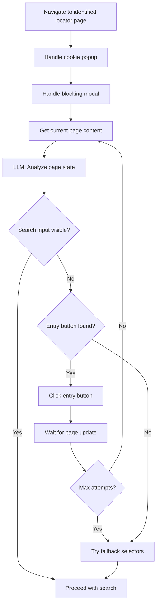

# Handle Entry Buttons with Real-Time LLM Page State Analysis

## Overview

Add real-time LLM-driven page state analysis to detect when a dealer locator page requires clicking through entry buttons before the search interface becomes available.

## Todos

- [ ] Add new `_build_page_state_prompt()` method in `llm_analyzer.py` for quick page state analysis
- [ ] Add `analyze_page_state()` method in `llm_analyzer.py` that returns search_ready or entry_button info
- [ ] Add `_get_page_content_for_llm()` method in `scrape_dealers.py` to extract current page content from Playwright
- [ ] Add `_navigate_to_search_interface()` method that loops until search input is found
- [ ] Integrate the navigation loop into `_scrape_zip()` after popup handling
- [ ] Add common entry button patterns to `base_config.yaml` as fallbacks

## Problem Statement

Some dealer locator pages require clicking an initial button (e.g., "Locate Dealer", "Find a Dealer") before the actual search interface becomes visible. The current scraper assumes the search interface is immediately available after page load.

**Key Requirement**: Use the LLM in real-time to analyze the current page state and determine if:
1. The zip code input field is already visible (ready to search)
2. An entry button needs to be clicked first (navigate through)

## Proposed Flow



## Implementation Plan

### 1. Add Page State Analysis Prompt

**File: [utils/llm_analyzer.py](../utils/llm_analyzer.py)**

Add a new lightweight prompt specifically for real-time page state analysis:

```python
def _build_page_state_prompt(self, content: str, url: str) -> str:
    """Build a lightweight prompt to analyze current page state."""
    # Truncate content more aggressively for speed
    content_preview = content[:4000]
    
    prompt = f"""Analyze this dealer locator page and determine its current state.

URL: {url}

Page Content:
{content_preview}

Return ONLY valid JSON:
{{
  "page_state": "search_ready" | "needs_entry_button" | "unknown",
  "search_input_visible": true | false,
  "entry_button": {{
    "found": true | false,
    "selector": "CSS selector for the button to click",
    "text": "Button text like 'Locate Dealer'"
  }},
  "confidence": 0.0-1.0
}}

Guidelines:
- "search_ready": A zip/location input field is visible and ready to use
- "needs_entry_button": No search input visible, but there's a CTA button like "Locate Dealer", "Find a Dealer", "Find Dealers Near You", "Get Started"
- Look for buttons/links with text containing: Locate, Find, Dealer, Search, Get Started
- The entry button is NOT a search submit button - it's a navigation button that reveals the search form
"""
    return prompt
```

Add a new method to call this prompt:

```python
def analyze_page_state(self, content: str, url: str) -> Optional[Dict[str, Any]]:
    """Quick analysis of current page state - is search ready or needs navigation?"""
    prompt = self._build_page_state_prompt(content, url)
    response = self._call_llm(prompt, timeout=30)  # Shorter timeout for quick check
    return self._parse_llm_response(response)
```

### 2. Add Page Content Extraction from Playwright

**File: [scrape_dealers.py](../scrape_dealers.py)**

Add a method to extract LLM-friendly content from the current Playwright page:

```python
async def _get_page_content_for_llm(self) -> str:
    """Extract current page content in LLM-friendly format."""
    # Get visible text content
    content = await self.page.evaluate('''() => {
        // Get all visible text, excluding scripts and styles
        const walker = document.createTreeWalker(
            document.body,
            NodeFilter.SHOW_TEXT,
            null,
            false
        );
        let text = [];
        while (walker.nextNode()) {
            const node = walker.currentNode;
            const parent = node.parentElement;
            if (parent && !['SCRIPT', 'STYLE', 'NOSCRIPT'].includes(parent.tagName)) {
                const trimmed = node.textContent.trim();
                if (trimmed) text.push(trimmed);
            }
        }
        return text.join(' ');
    }''')
    
    # Also get button/link text for entry button detection
    buttons = await self.page.evaluate('''() => {
        const elements = document.querySelectorAll('button, a, [role="button"]');
        return Array.from(elements).map(el => ({
            tag: el.tagName,
            text: el.textContent.trim(),
            href: el.href || '',
            class: el.className
        })).filter(el => el.text);
    }''')
    
    return f"Page Text:\n{content}\n\nButtons/Links:\n{json.dumps(buttons, indent=2)}"
```

### 3. Add Navigation Loop

**File: [scrape_dealers.py](../scrape_dealers.py)**

Add a method that loops until the search interface is found:

```python
async def _navigate_to_search_interface(self, max_attempts: int = 3) -> bool:
    """
    Navigate through entry buttons until the search interface is visible.
    Uses LLM to analyze page state in real-time.
    
    Returns:
        True if search interface is now accessible
    """
    for attempt in range(max_attempts):
        # Check if search input already exists
        search_input = await self._find_search_input()
        if search_input:
            return True
        
        # Get current page content for LLM analysis
        content = await self._get_page_content_for_llm()
        
        # Ask LLM to analyze page state
        page_state = self.llm_analyzer.analyze_page_state(content, self.url)
        
        if not page_state:
            print(f"  Warning: Could not analyze page state (attempt {attempt + 1})")
            continue
        
        state = page_state.get('page_state', 'unknown')
        
        if state == 'search_ready':
            return True
        
        if state == 'needs_entry_button':
            entry_info = page_state.get('entry_button', {})
            if entry_info.get('found'):
                selector = entry_info.get('selector')
                text = entry_info.get('text', 'entry button')
                
                print(f"  Clicking entry button: '{text}'")
                
                # Try to click the entry button
                clicked = await self._click_entry_button(selector, text)
                if clicked:
                    await asyncio.sleep(2)  # Wait for page update
                    continue
        
        # If we get here, try fallback entry button selectors
        if await self._try_fallback_entry_buttons():
            await asyncio.sleep(2)
            continue
        
        break
    
    # Final check
    return await self._find_search_input() is not None

async def _click_entry_button(self, selector: str, text: str) -> bool:
    """Try to click an entry button by selector or text."""
    try:
        # Try the LLM-provided selector first
        if selector:
            button = await self.page.query_selector(selector)
            if button and await button.is_visible():
                await button.click()
                return True
        
        # Fallback: try to find by text
        text_selectors = [
            f"button:has-text('{text}')",
            f"a:has-text('{text}')",
            f"[role='button']:has-text('{text}')"
        ]
        for sel in text_selectors:
            try:
                button = await self.page.query_selector(sel)
                if button and await button.is_visible():
                    await button.click()
                    return True
            except:
                continue
    except Exception as e:
        print(f"  Warning: Could not click entry button: {e}")
    return False

async def _try_fallback_entry_buttons(self) -> bool:
    """Try common entry button patterns from config."""
    fallback_selectors = self.selectors.get('entry_button', [])
    # Add hardcoded common patterns
    fallback_selectors.extend([
        "button:has-text('Locate Dealer')",
        "button:has-text('Find a Dealer')",
        "button:has-text('Find Dealer')",
        "a:has-text('Locate Dealer')",
        "a:has-text('Find a Dealer')",
        "[class*='dealer-locator'] button",
        "[class*='find-dealer'] a"
    ])
    
    for selector in fallback_selectors:
        try:
            button = await self.page.query_selector(selector)
            if button and await button.is_visible():
                await button.click()
                return True
        except:
            continue
    return False
```

### 4. Integrate into Scraping Flow

**File: [scrape_dealers.py](../scrape_dealers.py)**

Update `_scrape_zip()` to call the navigation loop after popup handling (around line 581):

```python
# After _handle_location_prompt()
await self._handle_location_prompt(zip_code)

# NEW: Navigate through entry buttons if needed
if self.enable_ai:
    search_ready = await self._navigate_to_search_interface()
    if not search_ready:
        print(f"  Warning: Could not navigate to search interface")

# Continue with existing flow...
search_input = await self._find_search_input()
```

### 5. Add Fallback Selectors to Config

**File: [configs/base_config.yaml](../configs/base_config.yaml)**

Add common entry button patterns:

```yaml
selectors:
  # Entry buttons that reveal the search interface
  entry_button:
    - "button:has-text('Locate Dealer')"
    - "button:has-text('Find a Dealer')"
    - "button:has-text('Find Dealer')"
    - "button:has-text('Find Dealers')"
    - "button:has-text('Dealer Locator')"
    - "a:has-text('Locate Dealer')"
    - "a:has-text('Find a Dealer')"
    - "a:has-text('Find Dealer')"
    - "[class*='locator-cta']"
    - "[class*='dealer-cta']"
    - "[class*='find-dealer'] button"
    - "[class*='dealer-locator'] a"
```

## Key Files to Modify

- [utils/llm_analyzer.py](../utils/llm_analyzer.py) - Add `_build_page_state_prompt()` and `analyze_page_state()` methods
- [scrape_dealers.py](../scrape_dealers.py) - Add `_get_page_content_for_llm()`, `_navigate_to_search_interface()`, `_click_entry_button()`, `_try_fallback_entry_buttons()` methods and integrate into `_scrape_zip()`
- [configs/base_config.yaml](../configs/base_config.yaml) - Add `entry_button` selector patterns as fallbacks

## Performance Considerations

- The page state analysis uses a **lightweight prompt** with shorter content (4000 chars vs 8000)
- Uses a **shorter timeout** (30s vs 120s) for quick turnaround
- **Maximum 3 attempts** to prevent infinite loops
- Falls back to **config-based selectors** if LLM analysis fails
- Only runs when `enable_ai=True`
